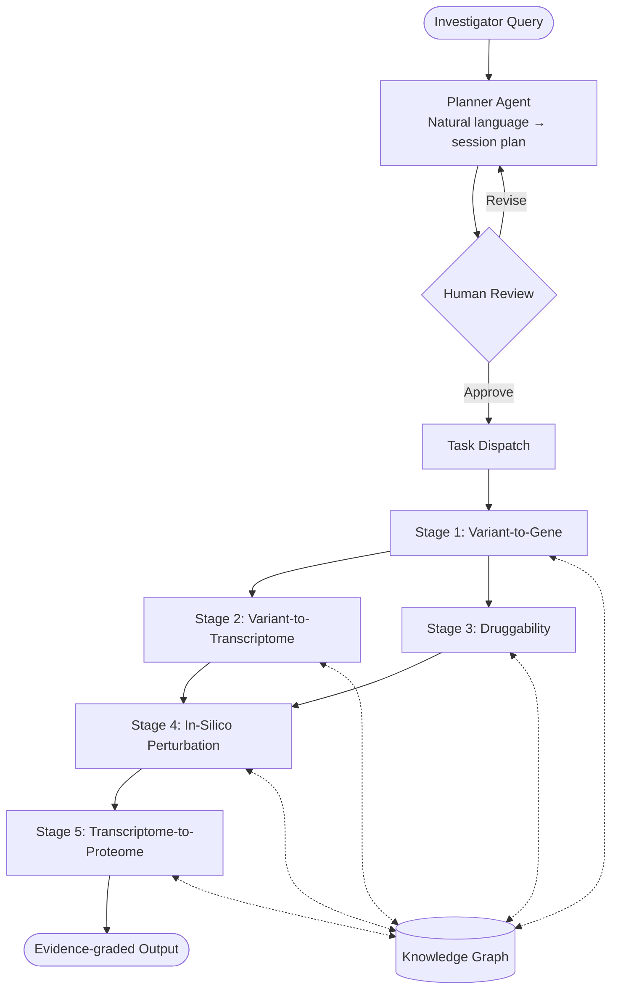

# AgentGWAS: An AI Agent System for End-to-End Post-GWAS Translational Analysis Using NIH Common Fund Program Data

## Significance

Genome-wide association studies (GWAS) have identified tens of thousands of robust variant-trait associations, yet the causal genes, regulatory mechanisms, and druggable targets underlying the  majority of these loci remain unresolved [1–4]. The NIH Common Fund has generated precisely the complementary, multi-modal datasets needed to close this gap through twenty programs spanning chromatin architecture (4DN), single-cell atlases (HuBMAP, SenNet), multi-tissue expression (GTEx, MoTrPAC), perturbation biology (LINCS), target pharmacology (IDG), and longitudinal clinical cohorts (A2CPS, iHMP), among others. Despite this investment, these resources remain isolated from GWAS workflows and from each other, accessible primarily to domain experts [5,6]. No automated, end-to-end infrastructure currently exists to orchestrate across them through a principled translational inference chain [7]. **AgentGWAS** addresses this gap as an automated pipeline to unify all twenty NIH Common Fund programs within a single large language model (LLM)-orchestrated translational framework, introducing three key innovations: (1) a multi-agent architecture that propagates calibrated uncertainty across a translational chain; (2) a mandatory human-in-the-loop review checkpoint that preserves investigator oversight; and (3) a unified knowledge graph enabling multi-hop evidence queries from genetic variant to therapeutic target [8].

## Goal and Objective

The **hypothesis** is that an LLM-orchestrated multi-agent framework can integrate heterogeneous NIH Common Fund datasets to recover validated causal genes and approved therapeutic targets at benchmark GWAS loci with greater reproducibility than single-program, expert-driven analyses and at substantially compressed analysis timelines relative to conventional manual workflows.

The **objective** is to develop, benchmark, and publicly release AgentGWAS, a modular agentic pipeline orchestrating a five-stage post-GWAS workflow integrating twenty NIH Common Fund datasets: (1) variant-to-gene resolution, (2) variant-to-transcriptome propagation, (3) druggability assessment, (4) in-silico perturbation simulation, and (5) transcriptome-to-proteome biomarker projection.

## Specific Aim

**Develop an agentic post-GWAS translational pipeline integrating twenty NIH Common Fund program datasets.** The pipeline will be implemented as an open-source software released via GitHub. A planner agent translates natural-language analysis requests into structured, human-reviewable session plans; execution proceeds only upon explicit investigator approval. Five specialized subagents execute the analytical stages in sequence or in parallel as dependencies permit, each passing quantified confidence estimates forward to inform subsequent stages. Statistically intensive operations, including fine-mapping, colocalization, and transcriptome-wide association analysis, are delegated to computational workflows separate from the planner agent layer. All results are recorded in a shared knowledge graph supporting evidence queries from variant to biomarker. An access governance module identifies controlled-access authorization gaps before execution begins. Full provenance records of software versions, parameters, and outputs ensure reproducibility.

**Validation** will employ benchmark loci for type 2 diabetes (TCF7L2, SLC30A8) and lipid metabolic traits (PCSK9, APOC3), evaluating recovery of known causal genes and identification of approved therapeutic targets as primary performance metrics.

## Expected Outcomes

Completion of this aim will deliver a publicly released, documented, and benchmarked software infrastructure for reproducible, end-to-end post-GWAS analysis. AgentGWAS is designed to substantially compress analysis timelines relative to conventional manual workflows, reduce barriers to cross-program evidence integration, and establish a reusable infrastructure that accelerates the translational impact of the NIH Common Fund portfolio.
---

## References

1. Claussnitzer, M., Cho, J.H., Collins, R., Cox, N.J., Dermitzakis, E.T. & Hurles, M.E. et al. A brief history of human disease genetics. *Nature* **577**, 179–189 (2020). https://doi.org/10.1038/s41586-019-1879-7

2. Tam, V., Patel, N., Turcotte, M., Bossé, Y., Paré, G. & Meyre, D. Benefits and limitations of genome-wide association studies. *Nat. Rev. Genet.* **20**, 467–484 (2019). https://doi.org/10.1038/s41576-019-0127-1

3. Gallagher, M.D. & Chen-Plotkin, A.S. The post-GWAS era: from association to function. *Am. J. Hum. Genet.* **102**, 717–730 (2018). https://doi.org/10.1016/j.ajhg.2018.04.002

4. Cannon, M.E. & Mohlke, K.L. Deciphering the emerging complexities of molecular mechanisms at GWAS loci. *Am. J. Hum. Genet.* **103**, 637–653 (2018). https://doi.org/10.1016/j.ajhg.2018.10.001

5. Cano-Gamez, E. & Trynka, G. From GWAS to function: using functional genomics to identify the mechanisms underlying complex diseases. *Front. Genet.* **11**, 424 (2020). https://doi.org/10.3389/fgene.2020.00424

6. Falola, O., Adam, Y. et al. SysBiolPGWAS: simplifying post-GWAS analysis through the use of computational technologies and integration of diverse omics datasets. *Bioinformatics* **39**, btac791 (2023). https://doi.org/10.1093/bioinformatics/btac791

7. Huang, J. et al. Twenty years of genome-wide association studies: health translation challenges and AI opportunities. *Eur. J. Hum. Genet.* https://doi.org/10.1038/s41431-025-01951-5 (2025).

8. Mountjoy, E., Schmidt, E.M., Carmona, M., Schwartzentruber, J., Peat, G. & Miranda, A. et al. An open approach to systematically prioritize causal variants and genes at all published human GWAS trait-associated loci. *Nat. Genet.* **53**, 1527–1533 (2021). https://doi.org/10.1038/s41588-021-00945-5

---

## Pipeline Overview

Figure. AgentGWAS pipeline architecture. Solid arrows indicate analytical data flow; dashed bidirectional arrows indicate read/write access to the shared knowledge graph. Following planner-agent session planning and mandatory human review, Stage 1 executes first; Stages 2 and 3 proceed in parallel; Stages 4 and 5 execute sequentially upon completion of their respective upstream stages.

