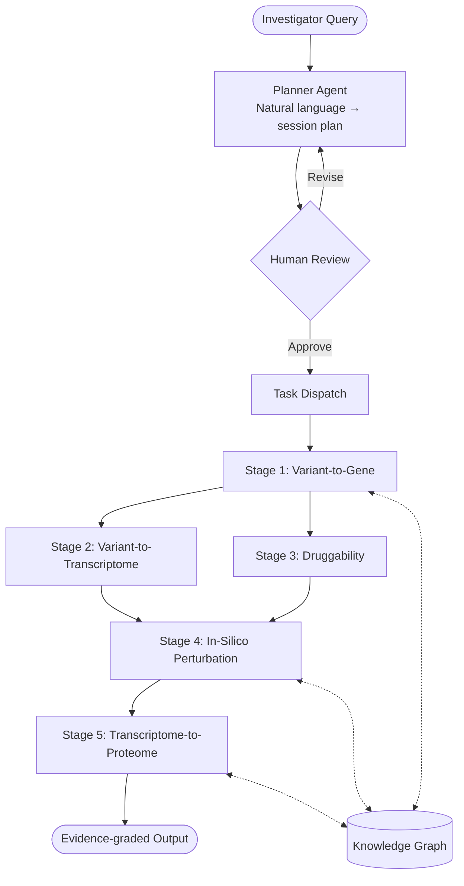

# AgentGWAS: An Agentic AI for End-to-End Post-GWAS Translational Analysis Using NIH Common Fund Program Data

## Significance

Genome-wide association studies (GWAS) have identified tens of thousands of robust variant-trait associations, yet fewer than 10% have been mechanistically resolved to causal genes, regulatory mechanisms, or druggable targets. The NIH Common Fund has generated precisely the orthogonal datasets required to close this gap through twenty programs spanning chromatin architecture (4DN), single-cell atlases (HuBMAP, SenNet), multi-tissue expression (GTEx, MoTrPAC), perturbation biology (LINCS), target pharmacology (IDG), and longitudinal clinical cohorts (A2CPS, iHMP), etc. Despite this investment, these resources remain isolated from GWAS workflows and from each other, accessible chiefly to domain experts. No automated, end-to-end infrastructure currently exists to orchestrate across them through a principled translational inference chain. **AgentGWAS** addresses this gap as the first software system to unify all twenty Common Fund programs within a single LLM-orchestrated translational pipeline, introducing three key innovations: (1) a multi-agent architecture that propagates calibrated uncertainty across a five-stage translational chain; (2) a mandatory human-in-the-loop review checkpoint that preserves investigator oversight; and (3) a unified knowledge graph enabling multi-hop evidence queries from genetic variant to therapeutic target.

## Goal and Objective

The **hypothesis** is that an LLM-orchestrated multi-agent framework can autonomously integrate heterogeneous Common Fund datasets to reproducibly recover known causal genes and therapeutic targets from GWAS loci, reducing translational analysis time from months to hours.

The **objective** is to develop, benchmark, and openly release AgentGWAS, a modular agentic pipeline orchestrating a five-stage post-GWAS workflow integrating twenty NIH Common Fund datasets: (1) variant-to-gene resolution, (2) variant-to-transcriptome propagation, (3) druggability assessment, (4) in-silico perturbation simulation, and (5) transcriptome-to-proteome biomarker projection.

## Specific Aim

**Develop an agentic post-GWAS translational pipeline integrating twenty NIH Common Fund program datasets.** The pipeline will be implemented as open-source software released via GitHub. A planner agent translates natural-language analysis requests into structured, human-reviewable session plans; execution proceeds only upon explicit investigator approval. Five specialized subagents execute the analytical stages in sequence or in parallel as dependencies permit, each passing quantified confidence estimates forward to inform subsequent stages. Statistically intensive operations, including fine-mapping, colocalization, and transcriptome-wide association analysis, are delegated to dedicated computational workflows separate from the LLM orchestration layer, enabling local and cloud execution. All results are recorded in a shared knowledge graph supporting evidence queries from variant to biomarker. An access governance module identifies controlled-access authorization gaps before execution begins. Full provenance records of software versions, parameters, and outputs ensure reproducibility.

**Validation** will employ benchmark loci for type 2 diabetes (TCF7L2, SLC30A8) and lipid metabolic traits (PCSK9, APOC3), evaluating recovery of known causal genes and identification of approved therapeutic targets as primary performance metrics.

## Expected Outcomes

Completion of this aim will deliver a publicly released, documented, and benchmarked software infrastructure for reproducible, end-to-end post-GWAS analysis. AgentGWAS will convert months of manual expert effort into hours of automated analysis, lower the barrier to cross-program evidence integration, and establish a reusable infrastructure that accelerates the translational impact of the NIH Common Fund portfolio.

---

## Pipeline Overview

