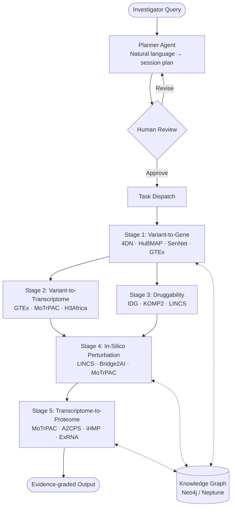

# AgentGWAS: An Agentic AI for End-to-End Post-GWAS Translational Analysis Using NIH Common Fund Program Data

## Significance

Genome-wide association studies (GWAS) have identified tens of thousands of robust variant-trait associations, yet fewer than 10% have been mechanistically resolved to causal genes, regulatory mechanisms, or druggable targets. The NIH Common Fund has precisely generated the orthogonal molecular datasets needed to bridge this gap through twenty programs spanning chromatin architecture (4DN), single-cell atlases (HuBMAP, SenNet), multi-tissue expression (GTEx, MoTrPAC), perturbation biology (LINCS), target pharmacology (IDG), and longitudinal clinical cohorts (A2CPS, iHMP), etc. Despite this investment, these resources remain isolated from each other and from GWAS workflows, accessible chiefly to experts fluent in their diverse access tiers, file formats, and identifier systems. No automated, end-to-end software infrastructure currently exists to orchestrate across them through a principled translational inference chain.

## Goal, Objective, and Proposed Work

The **goal** is to enable any investigator with GWAS summary statistics to obtain a prioritized, evidence-graded list of causal genes, druggable targets, and protein biomarkers without requiring specialist bioinformatics infrastructure. 

The **objective** of the present application is to develop, benchmark, and openly release **AgentGWAS**, a modular agentic pipeline that autonomously orchestrates a five-stage post-GWAS workflow integrating twenty NIH Common Fund datasets: (1) variant-to-gene resolution, (2) variant-to-transcriptome propagation, (3) druggability assessment, (4) in-silico perturbation simulation, and (5) transcriptome-to-proteome biomarker projection.

The **proposed work** is to implement an LLM-orchestrated multi-agent pipeline that coordinates the five analytical stages through structured reasoning, propagates quantified confidence scores between stages, and requires explicit investigator review and approval of the analysis plan before any computation begins.

## Specific Aim

**Develop an agentic post-GWAS translational pipeline integrating twenty NIH Common Fund program datasets.** The pipeline will be implemented as a package deployable, with an interface for open-source distribution and for cloud deployment. A planner agent will parse natural-language analysis requests into structured, human-reviewable session plans; execution proceeds only upon explicit investigator approval. The five stage subagents are planned through a stateful graph (LangGraph) in which each stage emits calibrated uncertainty scores consumed as continuous posteriors by downstream stages. Computationally intensive operations, including fine-mapping (SuSiE, FINEMAP), colocalization (coloc, eCAVIAR), and TWAS (S-PrediXcan, FUSION), are executed as containerized Nextflow workflows dispatched by the agent layer, separating LLM reasoning from deterministic bioinformatics computation and enabling both local HPC and AWS Batch execution. All intermediate results are persisted as typed nodes and edges in a property knowledge graph, with uncertainty scores as edge properties. An access governance layer consults a formal access manifest at plan-generation time, surfacing controlled-access authorization gaps before execution begins. Reproducibility is enforced through structured logging of tool versions, parameter configurations, random seeds, and artifact hashes conforming to W3C PROV standards.

**Validation** will employ established benchmark loci for type 2 diabetes and lipid metabolic traits as proof-of-concept, both selected for their highest end-to-end dataset applicability within the current complement, evaluating recovery of known causal genes within the top-ranked credible-set gene list and identification of approved therapeutic targets at Tclin or Tchem classification as primary performance metrics.

## Expected Outcomes

Completion of this aim will deliver a publicly released, documented, and benchmarked software infrastructure that any investigator can deploy to conduct reproducible, end-to-end post-GWAS analysis. By providing structured programmatic interfaces to all twenty Common Fund datasets through a unified agentic orchestration layer, AgentGWAS will convert months of manual expert effort into hours of automated analysis, substantially lower the barrier to cross-program evidence integration, and establish a reusable, extensible infrastructure that directly accelerates the translational impact of the NIH Common Fund portfolio.

---

## Pipeline Overview

